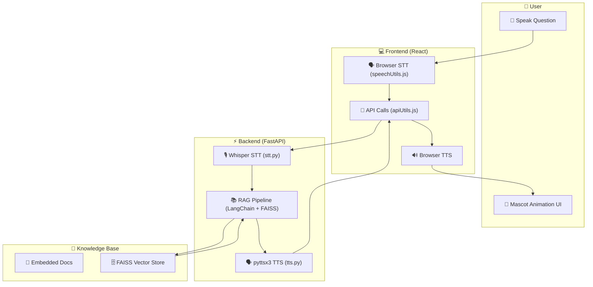

# 🎓 Conversational AI Tutor  

An **AI-powered conversational tutor** with **RAG backend, Speech-to-Text (STT), Text-to-Speech (TTS), and an animated mascot frontend**.  
This project was built as part of an **AI assignment challenge** to demonstrate **end-to-end AI system design, API integration, and deployment**.  

🔗 **Backend API**: [FastAPI Backend on Render](https://conversational-ai-tutor.onrender.com/)  

---

## 📌 Objective  

Build a **Conversational AI Tutor** that can:  
- Answer user queries using **RAG (Retrieval Augmented Generation)**.  
- Listen to the user via **speech recognition (STT)**.  
- Respond with voice via **text-to-speech (TTS)**.  
- Animate a mascot avatar with **lip-sync & emotions**.  

---

## ⚡ Features  

✅ **Backend (FastAPI + LangChain RAG + FAISS Vector DB)**  
- `/query` → Single query answering  
- `/chat` → Multi-turn conversational memory  
- Returns **answer + emotion state** (happy, thinking, explaining)  

✅ **Speech Recognition (STT)**  
- Implemented using **OpenAI Whisper**  

✅ **Text-to-Speech (TTS)**  
- Implemented using **pyttsx3 (offline TTS)**  

✅ **Frontend (React)**  
- Animated **Mascot UI**  
- **Mic button** → Speak → STT → Backend → Mascot speaks & animates  
- Supports **lip-sync and emotion-based facial animations**  

✅ **Deployment**  
- Backend deployed on **Render**  
- Frontend deployed on **Vercel**  

---

## 🛠️ Tech Stack  

- **Backend**: FastAPI, LangChain, FAISS, Whisper (STT), pyttsx3 (TTS)  
- **Frontend**: React.js, Web Audio API, Lottie/Canvas animations  
- **Deployment**: Render (Backend), Vercel (Frontend)  

---

## 📂 Project Structure  
```
conversational-ai-tutor/
├── backend/ # FastAPI backend
│ ├── init.py
│ ├── main.py # FastAPI app entry point
│ ├── rag_pipeline.py # RAG graph / LangChain integration
│ ├── stt.py # Whisper STT
│ ├── tts.py # pyttsx3 TTS
│
├── frontend/ # React frontend
│ ├── public/
│ │ └── index.html
│ ├── src/
│ │ ├── components/
│ │ │ ├── animations/
│ │ │ │ ├── Mascot.js
│ │ │ │ ├── Mascot.css
│ │ │ │ ├── Controls.js
│ │ │ │ ├── Controls.css
│ │ │ │ ├── StatusIndicator.js
│ │ │ │ ├── StatusIndicator.css
│ │ │ │ ├── LipSyncHandler.js # Optional advanced animation handling
│ │ │ │ └── TypingIndicator.js # Optional typing animation
│ │ ├── utils/
│ │ │ ├── speechUtils.js # Browser STT/TTS utilities
│ │ │ ├── apiUtils.js # API call utilities
│ │ │ └── tts.js # Optional TTS handler
│ │ ├── App.js
│ │ ├── App.css
│ │ └── index.js
│ ├── .env # REACT_APP_API_URL pointing to backend
│ ├── package.json
│ └── README.md
│
├── vector_store/ # FAISS vector DB files
├── knowledge_base/ # Embedded documents / knowledge files
├── .env # Backend environment config
├── requirements.txt # Python dependencies for backend
└── README.md
```

## Workflow Architecture



## ⚙️ Local Setup  

### 1️⃣ Backend (FastAPI)  

```bash
# Clone repository
git clone https://github.com/yourusername/conversational-ai-tutor.git
cd conversational-ai-tutor/backend

# Create virtual environment
python -m venv venv
source venv/bin/activate   # (Linux/Mac)
venv\Scripts\activate      # (Windows)

# Install dependencies
pip install -r requirements.txt

# Run FastAPI backend
uvicorn main:app --reload --port 8000
```
Backend will run at: http://127.0.0.1:8000
Swagger Docs: http://127.0.0.1:8000/docs

2️⃣ Frontend (React)
cd conversational-ai-tutor/frontend

# Install dependencies
npm install

# Start frontend
npm start


Frontend will run at: 👉 http://localhost:3000

🌍 Live Deployment

Backend (Render): https://conversational-ai-tutor.onrender.com/

Frontend (Vercel): https://conversational-ai-tutor.vercel.app/

📡 API Endpoints
🔹 1. Query Endpoint

POST https://conversational-ai-tutor.onrender.com/query

Headers:

Content-Type: application/json


Body Example:

{
  "question": "What is sustainable agriculture and how does it differ from the Green Revolution?"
}


Response Example:

{
  "answer": "Sustainable agriculture focuses on long-term ecological balance...",
  "emotion": "explaining"
}

🔹 2. Chat Endpoint

POST https://conversational-ai-tutor.onrender.com/chat

Supports multi-turn conversations.

🔹 3. API Docs

Swagger API Docs available at:
👉 https://conversational-ai-tutor.onrender.com/docs

🧪 Testing with Postman

Open Postman.

Create a POST request to:

https://conversational-ai-tutor.onrender.com/query

https://conversational-ai-tutor.onrender.com/chat

Add Header: Content-Type: application/json.

Add request Body with JSON question.

Click Send → Get AI Tutor response.

🎭 Mascot UI Flow

Click 🎤 Mic Button → Speak a question.

Browser STT transcribes → sends to Backend.

Backend (RAG) retrieves & generates response.

Returns { "answer": "...", "emotion": "happy" }.

Mascot speaks the response with lip-sync + emotion.

