# Conversational AI Tutor  

An **AI-powered conversational tutor** with **RAG backend, Speech-to-Text (STT), Text-to-Speech (TTS), and an animated mascot frontend**.  
This project was built as part of an **AI assignment challenge** to demonstrate **end-to-end AI system design, API integration, and deployment**.  

1. **Live Demo**: [Conversational AI Tutor](https://conversational-ai-tutor.vercel.app/)
2. **Backend API**: [FastAPI Backend on Render](https://conversational-ai-tutor.onrender.com/)  

---

## Objective  

Build a **Conversational AI Tutor** that can:  
- Answer user queries using **RAG (Retrieval Augmented Generation)**.  
- Listen to the user via **speech recognition (STT)**.  
- Respond with voice via **text-to-speech (TTS)**.  
- Animate a mascot avatar with **lip-sync & emotions**.  

---

## Features  

**Backend (FastAPI + LangChain RAG + FAISS Vector DB)**  
- `/query` → Single query answering  
- `/chat` → Multi-turn conversational memory  
- Returns **answer + emotion state** (happy, thinking, explaining)  

**Speech Recognition (STT)**  
- Implemented using **OpenAI Whisper**  

**Text-to-Speech (TTS)**  
- Implemented using **pyttsx3 (offline TTS)**  

**Frontend (React)**  
- Animated **Mascot UI**  
- **Mic button** → Speak → STT → Backend → Mascot speaks & animates  
- Supports **lip-sync and emotion-based facial animations**  

**Deployment**  
- Backend deployed on **Render**  
- Frontend deployed on **Vercel**  

---

## Tech Stack  

- **Backend**: FastAPI, LangChain, FAISS, Whisper (STT), pyttsx3 (TTS)  
- **Frontend**: React.js, Web Audio API, Lottie/Canvas animations  
- **Deployment**: Render (Backend), Vercel (Frontend)  

---

## Project Structure  
```
conversational-ai-tutor/
├── backend/                                                     # FastAPI backend
│ ├── init.py
│ ├── main.py                                                    # FastAPI app entry point
│ ├── rag_pipeline.py                                            # RAG graph / LangChain integration
│ ├── stt.py                                                     # Whisper STT
│ ├── tts.py                                                     # pyttsx3 TTS or gTTS
│
├── frontend/                                                    # React frontend
│ ├── public/
│ │ └── index.html
│ ├── src/
│ │ ├── components/
│ │ │ ├── animations/
│ │ │ │ ├── Mascot.js
│ │ │ │ ├── Mascot.css
│ │ │ │ ├── Controls.js
│ │ │ │ ├── Controls.css
│ │ │ │ ├── StatusIndicator.js
│ │ │ │ ├── StatusIndicator.css
│ │ │ │ ├── LipSyncHandler.js                                    # Optional advanced animation handling
│ │ │ │ └── TypingIndicator.js                                   # Optional typing animation
│ │ ├── utils/
│ │ │ ├── speechUtils.js                                         # Browser STT/TTS utilities
│ │ │ ├── apiUtils.js                                            # API call utilities
│ │ │ └── tts.js                                                 # Optional TTS handler
│ │ ├── App.js
│ │ ├── App.css
│ │ └── index.js
│ ├── .env                                                       # REACT_APP_API_URL pointing to backend
│ ├── package.json
│ └── README.md
│
├── vector_store/                                                # FAISS vector DB files
├── knowledge_base/                                              # Embedded documents / knowledge files
├── .env                                                         # Backend environment config
├── requirements.txt                                             # Python dependencies for backend
└── README.md
```

## Workflow Architecture

```mermaid
flowchart TD

    subgraph User["🧑 User"]
        Mic["🎤 Speak Question"]
        Mascot["🤖 Mascot Animation UI"]
    end

    subgraph Frontend["💻 Frontend (React)"]
        STT_Browser["🗣️ Browser STT (speechUtils.js)"]
        API_Calls["📡 API Calls (apiUtils.js)"]
        TTS_Browser["🔊 Browser TTS"]
    end

    subgraph Backend["⚡ Backend (FastAPI)"]
        STT["🎙️ Whisper STT (stt.py)"]
        RAG["📚 RAG Pipeline (LangChain + FAISS)"]
        TTS["🗣️ pyttsx3 TTS (tts.py)"]
    end

    subgraph KnowledgeBase["📂 Knowledge Base"]
        Docs["📄 Embedded Docs"]
        VDB["🗄️ FAISS Vector Store"]
    end

    %% User Flow
    Mic --> STT_Browser --> API_Calls --> STT
    STT --> RAG
    RAG --> VDB
    VDB --> RAG
    RAG --> TTS
    TTS --> API_Calls --> TTS_Browser --> Mascot
```



## ⚙️ Local Setup  

### 1️. Backend (FastAPI)  

```bash
# Clone repository
git clone https://github.com/yourusername/conversational-ai-tutor.git
cd conversational-ai-tutor/backend

# Create virtual environment
python -m venv venv
source venv/bin/activate   # (Linux/Mac)
venv\Scripts\activate      # (Windows)

# Install dependencies
pip install -r requirements.txt

# Run FastAPI backend
uvicorn main:app --reload --port 8000
```
Backend will run at: http://127.0.0.1:8000
Swagger Docs: http://127.0.0.1:8000/docs

### 2. Frontend (React)
```bash
cd conversational-ai-tutor/frontend

# Install dependencies
npm install

# Start frontend
npm start
```

Frontend will run at: http://localhost:3000

## Live Deployment

- Backend (Render): https://conversational-ai-tutor.onrender.com/
- Frontend (Vercel): https://conversational-ai-tutor.vercel.app/
  
## API Endpoints
1. Query Endpoint
POST https://conversational-ai-tutor.onrender.com/query

Headers:
```bash
Content-Type: application/json
```
Body Example:
```
{
  "question": "What is sustainable agriculture and how does it differ from the Green Revolution?"
}
```
Response Example:
```
{
  "answer": "Sustainable agriculture focuses on long-term ecological balance...",
  "emotion": "explaining"
}
```

2. Chat Endpoint
POST https://conversational-ai-tutor.onrender.com/chat

Supports multi-turn conversations.

3. API Docs
Swagger API Docs available at:
```
https://conversational-ai-tutor.onrender.com/docs
```

## Testing with Postman
1. Open Postman.
2. Create a POST request to:
   - https://conversational-ai-tutor.onrender.com/query
   - https://conversational-ai-tutor.onrender.com/chat
3. Add Header: Content-Type: application/json.
4. Add request Body with JSON question.
5. Click Send → Get AI Tutor response.

## Mascot UI Flow
1. Click 🎤 Mic Button → Speak a question.
2. Browser STT transcribes → sends to Backend.
3. Backend (RAG) retrieves & generates response.
4. Returns { "answer": "...", "emotion": "happy" }.
5. Mascot speaks the response with lip-sync + emotion.


## Future Enhancements
1. Integrate advanced TTS (e.g., ElevenLabs / Coqui TTS for natural voices).
2. Add support for multiple subjects/domains in knowledge base.
3. Improve mascot animations with real-time lip-sync.
4. Add authentication and user history tracking.


